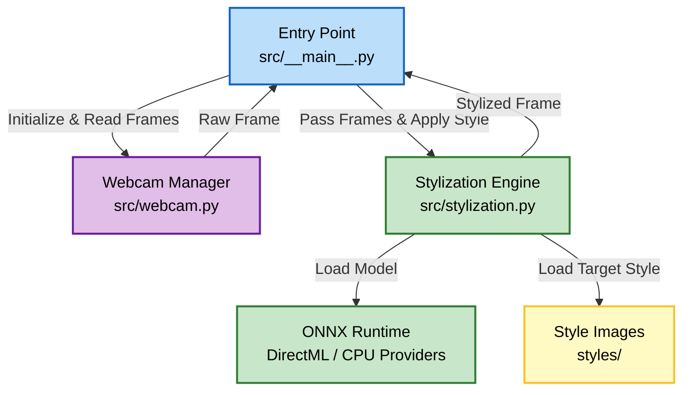
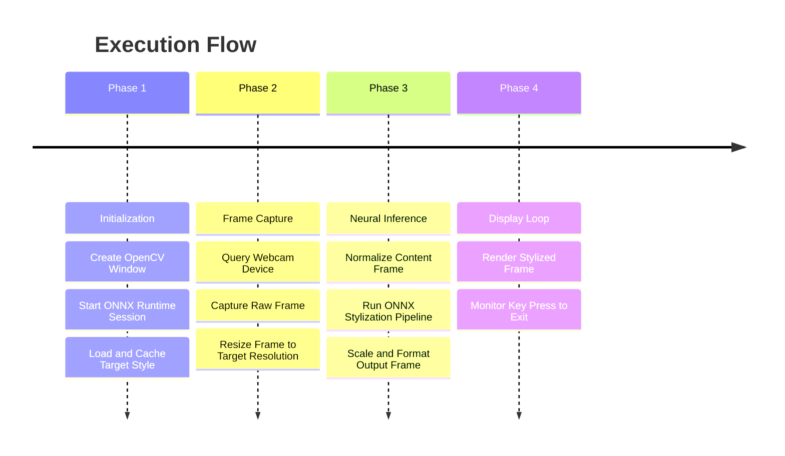

# Opsis

Real-time webcam stylization using deep learning and DirectML acceleration.

## Authors

- [@0xS4cha](https://github.com/0xS4cha)

## Description

This project is a Python application focused on real-time webcam video stream style transfer. It utilizes ONNX Runtime with DirectML acceleration to perform fast inference on Windows graphics hardware. The application loads a pretrained arbitrary style transfer model (Magenta) and applies user-selected artistic styles to frames captured via OpenCV in real time.



## Instruction

Opsis is managed using standard Python packaging tools like `uv`. You can install the dependencies and set up the environment easily.

Install the project dependencies:

```bash
uv sync
```

## Usage

Run the main application to start the real-time webcam stylization stream:

```bash
uv run python -m src
```

To exit the webcam window, press the `q` key on your keyboard.

### Selecting Styles

The application default style is set to Picasso. To use a different artistic style, modify the style image path in `src/__main__.py`:

```python
# Change this line in src/__main__.py to use another style image
stylization.setStyle("styles/vangogh.jpg")
```

Available style images in the `styles` directory include:
- `cyberpunk.jpg`
- `great_wave.jpg`
- `leonarddevinci.jpg`
- `minecraft.jpg`
- `monalisa.jpg`
- `monet.jpg`
- `munch.jpg`
- `picasso.jpg`
- `vangogh.jpg`
- `vangogh2.jpg`

## Algorithms

### Deep Learning Style Transfer

The project implements a real-time arbitrary style transfer inference pipeline:
- **Arbitrary Image Stylization**: The model uses a dual-network architecture where a style prediction network generates a representation vector of the target style, which is then fed into a transformer network using conditional instance normalization to paint the content image.
- **Pretrained ONNX Model**: Utilizes a serialized ONNX model (`magenta_stylization.onnx`) derived from the Magenta project, enabling fast runtime and cross-platform compatibility.
- **Pre-processing and Post-processing**: Captures camera input, rescales and normalizes pixel intensities to the `[0.0, 1.0]` range, performs tensor reshaping, and translates the styled tensor output back to standard 8-bit BGR format for display.

### Hardware Acceleration

- **DirectML Execution Provider**: Utilizes DirectML (`onnxruntime-directml`) on Windows platforms to map ONNX operators directly onto compatible graphics hardware (DirectX 12 capable GPUs), ensuring optimal frames-per-second performance during execution.
- **CPU Fallback**: Gracefully falls back to standard CPU execution if DirectML compatible devices or drivers are not detected.



## Project Structure

```
│  pyproject.toml   # Project configuration and dependencies
│  uv.lock          # Dependency lockfile
├─ styles/          # Pretrained model and style target images
│  ├── magenta_stylization.onnx
│  ├── cyberpunk.jpg
│  ├── great_wave.jpg
│  ├── leonarddevinci.jpg
│  ├── minecraft.jpg
│  ├── monalisa.jpg
│  ├── monet.jpg
│  ├── munch.jpg
│  ├── picasso.jpg
│  ├── vangogh.jpg
│  └── vangogh2.jpg
└─ src/
   ├── __init__.py  # Package initialization
   ├── __main__.py  # Entry point and real-time execution loop
   ├── stylization.py # Stylization engine using ONNX Runtime
   └── webcam.py    # OpenCV webcam feed capture helper
```

## Resources

- [ONNX Runtime](https://onnxruntime.ai/) - Cross-platform machine learning model accelerator
- [DirectML](https://learn.microsoft.com/en-us/windows/ai/directml/dml-intro) - Low-level API for hardware-accelerated machine learning
- [OpenCV](https://opencv.org/) - Open Source Computer Vision Library
- [Magenta Style Transfer](https://github.com/tensorflow/magenta/tree/master/magenta/models/arbitrary_image_stylization) - Arbitrary Image Stylization Model


## Feedback

If you have feedback, open an issue or contact the author.
